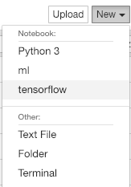
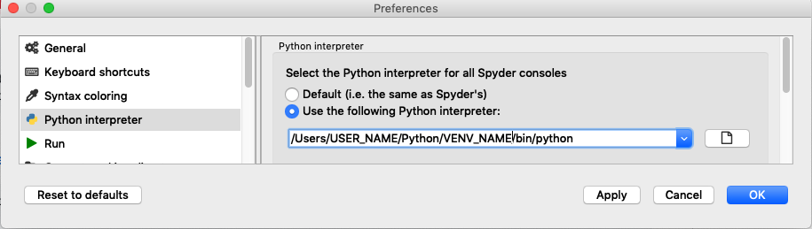

# Python Setup
updated 19 Jan 2019

I recommend using vanilla python instead of the conda distro so you have control over the packages and ecosystem you decide to implement.

1. Decide whether to use vanilla Python or an optimized version:
If you are doing a lot of ML work, it may be worth using linear algebra libraries that have been optimized for the instruction set supported by your processor(s). In this case, you may have to edit your Python/R installations as well as update evironmental variables on your OS to point to the optimized libraries .
In fact, while you can hack it yourself by downloading some optimized BLAS packages and enabling multithreaded performance, Intel has done all of the hard lifting for you!
   * [Vanilla Python](https://www.python.org/downloads/) (current Python version 3.7.x, however if you decide to use TensorFlow and don't want to jump through a lot of hoops, install Python 3.6.x)
      * we can use optimized libraries by installing [intel versions of scipy and numpy](https://software.intel.com/en-us/articles/installing-the-intel-distribution-for-python-and-intel-performance-libraries-with-pip-and)
   * [Intel Optimized Python](https://software.intel.com/en-us/distribution-for-python) (current Python version 3.6.x)
Note, while the most recent vanilla python version is 3.7.x, this is incompatible with tensorflow, so I'd recommend using 3.6.x regardless.
3. Ensure PATH is correct (see [.bash_profile](https://github.com/ahgraber/ml_setup/edit/master/bash_profile.md))  
4. Load python packages to support dev environment.  If using jupyter notebook or spyder3 on macOS, it may be a good idea to [download xQuartz](https://www.xquartz.org/) and install
```
# environments
pip3 install virtualenv     # virtual environments
pip3 install Cython         # good to have
pip3 install jupyter        # jupyter notebooks
pip3 install PyQt5          # for spyder
pip3 install spyder         # sPyder (RStudio for Python) see also: https://docs.spyder-ide.org/installation.html#installing-with-pip-experts-only
```
   * #### See .bash_profile for aliases and paths for easy launching of jupyter notebooks, etc.
   * #### Create App Launchers (macOS): To launch Spyder or Jupyter Notebooks from an app icon:
     1. Open Applescript Editor
     2. Write script as follows, and save as type Application in your Applications folder
     ```
     tell application "Terminal"
      do script "/Library/Frameworks/Python.framework/Versions/3.7/bin/jupyter-notebook; exit"
     end tell
     ```
     ```
     tell application "Terminal"
      do script "/Library/Frameworks/Python.framework/Versions/3.7/bin/spyder3; exit"
     end tell
     ```
     3. Download the app icon
     4. Open the icon in Preview and ctrl+C to copy
     5. Right-click on the app with the Applescript icon and select 'Get Info'
     6. Click the icon in the top-left corner of the info panel and hit ctrl-V to paste  


5. **BEFORE LOADING OTHER PACKAGES**, create a virtual environment for ML projects.  
See [venv](https://docs.python.org/3/library/venv.html) and [virtualenv](https://docs.python-guide.org/dev/virtualenvs/) for more
   1. Create a folder for your ml virtual environment (or, if you plan to do this on a per-project basis, create your project folder)
   2. In terminal, create your virtual environment
   ```
   # cd /path/to/directory
   # python3 -m venv VIRTUALENV_NAME
   cd ~/Python
   python3 -m venv ml
   ```
   3. Activate your virtual environment
   ```
   # source /path/to/virtualenv_name/bin/activate
   source VIRTUALENV_NAME/bin/activate
   ```
   4. To exit the virtual environment
   ```
   deactivate
   ```

```
# Note: I have python 2.7 and 3.7 installed, so pip3 installs for my python3 installation

# Activate virtual environment
source /path/to/virtualenv_name/bin/activate
```
6. Prepare kernel for ipynotebooks (jupyter or spyder) . 
(ref: https://anbasile.github.io/programming/2017/06/25/jupyter-venv/)
```
pip3 install ipykernel
ipython kernel install --user --name=VIRTUALENV_NAME
```
**Jupyter**: Now you can start jupyter, create a new notebook and select the appropriate kernel from the drop-down.
  
**Spyder**: Open spyder, open preferences, change the interpreter manually to the path of your virtual environment
  
```
# /path/to/virtualenv
/Users/USER_NAME/Python/VIRTUALENV_NAME/bin/python
```
Then right-click on the console and restart the kernel

7. Install (applicable) packages 
```
# standard packages
pip3 install intel-numpy    # arrays/matrices
pip3 install pandas         # data frames
pip3 install intel-scipy    # standard
pip3 install sympy          # symbolic math
pip3 install matplotlib     # visualization
pip3 install seaborn        # visualization

# machine learning models
pip3 install statsmodels    # statistical modeling
pip3 install intel-scikit-learn   # machine learning
pip3 install sklearn        # machine learning
pip3 install xgboost        # xgboost

# forecasting
pip3 install tslearn        # time series
pip3 install prophet        # forecasting with multiple seasonality

# for tensorflow
pip3 install keras          # for prototyping tensorflow
pip3 install tensorflow     # tensorflow!
pip3 install plaidml        # for non-Nvidia GPU acceleration
pip3 install plaidml-keras  # for non-Nvidia GPU acceleration

# web scraping
pip3 install beautifulsoup  # for web scraping

# for nlp
pip3 install ntlk           # natural language toolkit
pip3 install textblob       # interface for ntlk
pip3 install spaCy          # fast nlp
pip3 install gensim         # topic modeling
```

## Tensorflow Setup
8. Unfortunately, as of Jan 2019, the most recent tensorflow (1.12) does not work with the latest release of python (3.7)
